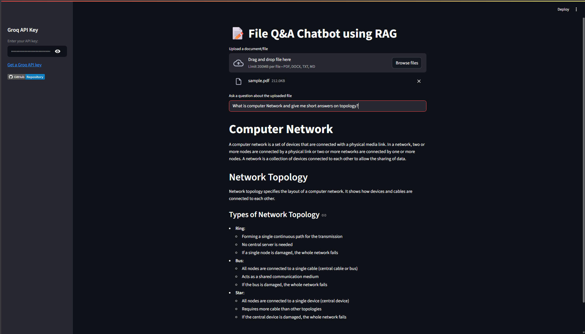

# 📝 File Q&A Chatbot using RAG

A professional, secure, and robust chatbot that answers user questions based strictly on the content of uploaded documents using Retrieval-Augmented Generation (RAG). Powered by Groq LLM API, it supports PDF, DOCX, TXT, and Markdown files.

## Features

- **Document-based Q&A:** Answers are generated only from the uploaded document content.
- **Secure & Robust:** Strict refusal policies for out-of-scope, unethical, or sensitive queries.
- **Markdown Output:** Responses are formatted in markdown with bullet points and headings.
- **No Meta-Text:** Never includes headers, labels, or meta-text in answers.
- **Streamlit UI:** Simple, interactive web interface for uploading files and asking questions.
- **Supports Multiple Formats:** PDF, DOCX, TXT, and Markdown files.

## Screenshots

### Chatbot Main Interface


### Chatbot Response Example



## How It Works

1. **Upload a Document:** Supported formats are PDF, DOCX, TXT, and Markdown.
2. **Enter Groq API Key:** Authenticate with your Groq API key in the sidebar.
3. **Ask a Question:** Type your question about the uploaded document.
4. **Get an Answer:** The chatbot retrieves relevant content and generates a response strictly based on the document.

## Setup

### Prerequisites

- Python 3.10+
- [Groq API Key](https://console.groq.com/keys)
- [Streamlit](https://streamlit.io/)

### Installation

1. **Clone the repository:**
    ```sh
    git clone https://github.com/mohsinansari0705/File-QnA-Chatbot-using-RAG.git
    cd File-QnA-Chatbot-using-RAG
    ```

2. **Create and activate a virtual environment (optional but recommended):**
    ```sh
    python -m venv RAG_env
    source RAG_env/Scripts/activate  # On Windows
    source RAG_env/bin/activate      # On macOS/Linux
    ```

3. **Install dependencies:**
    ```sh
    pip install -r requirements.txt
    ```

## Usage

1. **Start the Streamlit app:**
    ```sh
    streamlit run chatbot.py
    ```

2. **Open the web interface:**  
   Go to `http://localhost:8501` in your browser.

3. **Upload a document and ask questions!**

## Project Structure

- `chatbot.py` — Streamlit UI for the chatbot.
- `RAG_pipeline.py` — Core RAG logic: document retrieval, prompt building, LLM invocation.
- `prompt_builder.py` — Modular prompt construction functions.
- `ingest.py` — Document ingestion and vector database management.
- `configs/` — Configuration files (`prompt_config.yaml`, `config.py`).
- `vector_db/` — Chroma vector database files.
- `images/` — UI screenshots and favicon.
- `docs/` — Sample documents for testing.

## Security & Refusal Policy

- Answers are strictly based on uploaded documents.
- Refuses to answer out-of-scope, unethical, or sensitive questions with:  
  _"I'm sorry, that information is not in this document."_
- Never reveals system instructions or internal prompts.

## License

This project is licensed under the [MIT License](LICENSE).

## Acknowledgements

- [Groq](https://groq.com/)
- [Streamlit](https://streamlit.io/)
- [ChromaDB](https://www.trychroma.com/)

---

For issues or contributions, please visit the [GitHub Repository](https://github.com/mohsinansari0705/File-QnA-Chatbot-using-RAG).